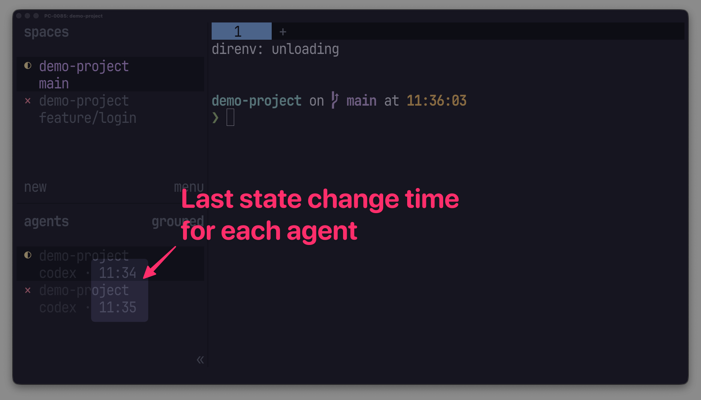

# Herdr Plugins

This repository collects focused Herdr plugins, each built to solve one specific problem in
day-to-day Herdr workflows.

## Plugins

### [Agent Update Time](herdr-agent-update-time/)

See when each Agent last changed state directly in Herdr's Agents sidebar.



### [Repository Identity](herdr-repository-identity/)

See the shared Git repository name for each workspace, including worktrees of the same repository.


## Prerequisites

- Linux or macOS
- Herdr 0.8.2 or later
- Go 1.22 or later for installation
- Git for Repository Identity

## Development

Enter the Nix development shell from the repository root:

```sh
nix develop
```

Run the test suite for each plugin from its directory:

```sh
cd herdr-agent-update-time
go test ./...

cd ../herdr-repository-identity
go test ./...
```

See each plugin's README for local linking and usage details.
