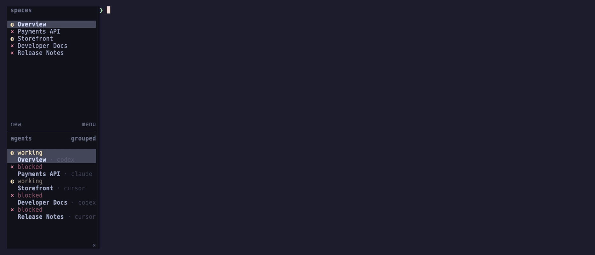

# Herdr Next Agent

Move forward or backward through Agents in configured semantic states across all Herdr workspaces
and tabs.



By default, the plugin moves through `blocked` Agents in the order shown in Herdr's Agents sidebar.

## Install

Installation requires Herdr 0.8.2 or newer and Go 1.22 or newer:

```sh
herdr plugin install choplin/herdr-plugins/herdr-next-agent
```

The manifest builds a native binary during installation, so the plugin has no runtime language
dependency.

## Example

Add the following to `~/.config/herdr/config.toml` to move between blocked Agents with
`Ctrl+Shift+.` and `Ctrl+Shift+,`:

```toml
[[keys.command]]
key = "ctrl+shift+."
type = "plugin_action"
command = "choplin.next-agent.next"
description = "Focus next blocked Agent"

[[keys.command]]
key = "ctrl+shift+,"
type = "plugin_action"
command = "choplin.next-agent.previous"
description = "Focus previous blocked Agent"
```

Reload the configuration:

```sh
herdr server reload-config
```

With the default configuration, press `Ctrl+Shift+.` to focus the next blocked Agent or
`Ctrl+Shift+,` to focus the previous one. Navigation wraps at either end of the Agents sidebar. If
focusing changes the current Agent's state, its position in the sidebar still determines where the
next search begins.

When no Agent matches `states`, Herdr shows a `No matching Agents` notification and leaves focus
unchanged.

## Configuration

Next Agent exposes two plugin actions:

- `choplin.next-agent.next`: move forward.
- `choplin.next-agent.previous`: move backward.

Use either value for the `command` field of a `plugin_action` keybinding. The `key` may be any
supported Herdr key chord.

Open the plugin config directory and create `config.toml` to change the target states or traversal
order:

```sh
CONFIG_DIR="$(herdr plugin config-dir choplin.next-agent)"
${EDITOR:-vi} "$CONFIG_DIR/config.toml"
```

For example, the following configuration visits `blocked` and `done` Agents in display order:

```toml
states = ["blocked", "done"]
order = "display"
```

`states` accepts one or more Herdr semantic states: `idle`, `working`, `blocked`, `done`, and
`unknown`. It defaults to `["blocked"]`.

`order` accepts:

- `display`: follow the Agents sidebar order. This is the default.
- `waiting`: follow the current state-change sequence, oldest first.

The action is available from pane and workspace contexts.

## How it works

The plugin reads Herdr's current Agent list and keeps Agents whose semantic state appears in
`states`. It uses either Herdr's display order or each Agent's state-change sequence, depending on
`order`, and moves forward or backward from the focused Agent.

## Manual invocation and logs

Invoke either action without a keybinding:

```sh
herdr plugin action invoke next --plugin choplin.next-agent
herdr plugin action invoke previous --plugin choplin.next-agent
```

Inspect command logs with:

```sh
herdr plugin log list --plugin choplin.next-agent
```

## Local development

`herdr plugin link` does not run manifest build commands, so build before linking:

```sh
nix develop
cd herdr-next-agent
go build -trimpath -o herdr-next-agent ./cmd/herdr-next-agent
herdr plugin link .
```

Run the test suite with:

```sh
go test ./...
```
